<h1 align="center">Moto Back</h1>

----

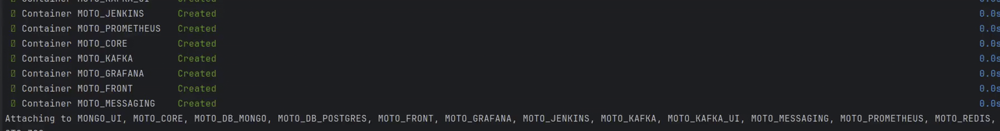

----
## Stack
Kotlin, Java, Spring Boot, Security, WebFlux, Kafka, PostgreSQL,  
Mongo, Redis, Grafana / Prometheus, Junit / Mockito, Jenkins, Gradle.
____
## Short description
This is a Spring WebFlux-based abstract CRUD application featuring:
<li>Authentication / Authorization</li>
<li>Reactive MongoDB, Redis, and PostgreSQL support</li>
<li>Configurable caching layer</li>
<li>Messaging functionality</li>
<li>Comprehensive monitoring</li>
<li>CI/CD pipeline with Docker Compose and related configurations</li>

____
## Authentication and Authorization
Spring Security helps authenticate users by retrieving their details from MongoDB.  
Authorization is implemented using JWT tokens.  
The resulting token is securely stored in an HTTP-only cookie on the client side.
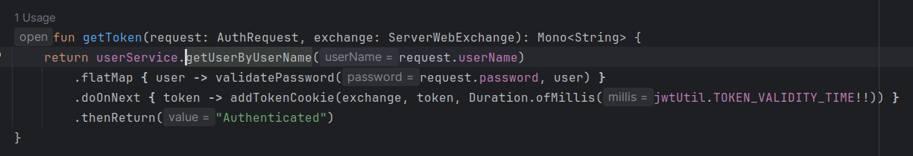
____
## Cache
Cache is configured via cacheManager in RedisConfig, with configurable TTL (time-to-live) parameters.  
Doing so, different parts of application's cache can be fine-tuned.
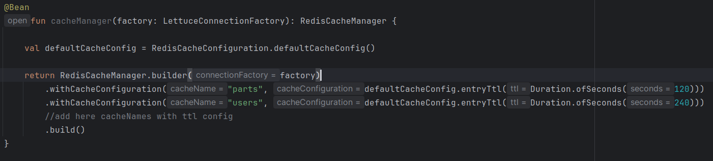
____
## Messaging

Messaging functionality is implemented using the spring-boot-starter-mail dependency within the "messaging" service.
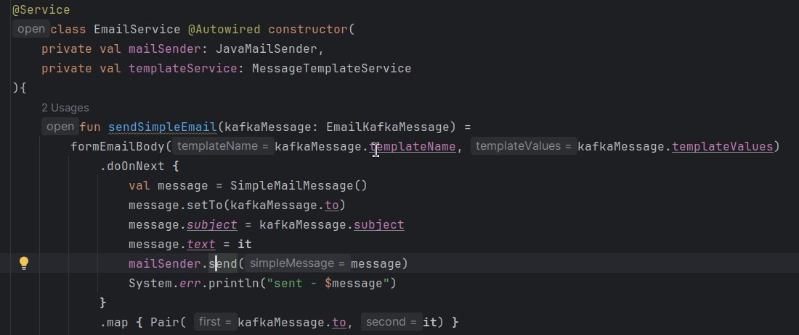
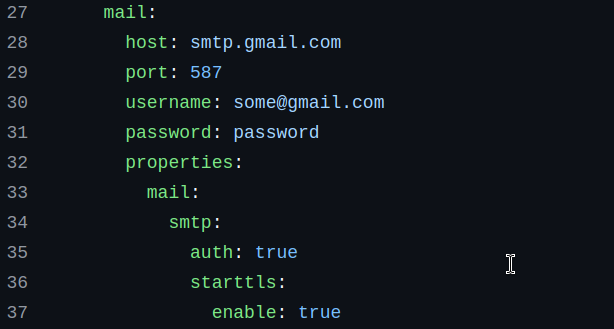
____
## Microservices communication
Kafka serves as a communication medium.  
Producer:  
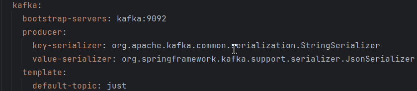  
Consumer:  
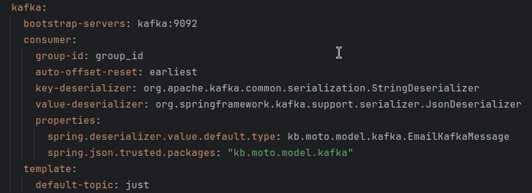
____
## Test
Testing is done with a help of JUnit / Mockito.
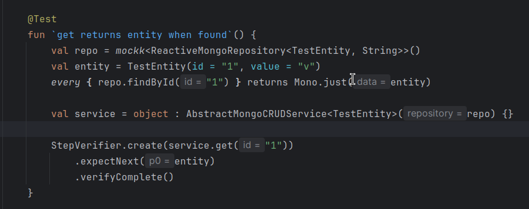
____
## Monitoring
Grafana / Prometheus are integrated to provide real-time monitoring of application metrics.  
CPU, Memory usage, I/O are among much more metrics.
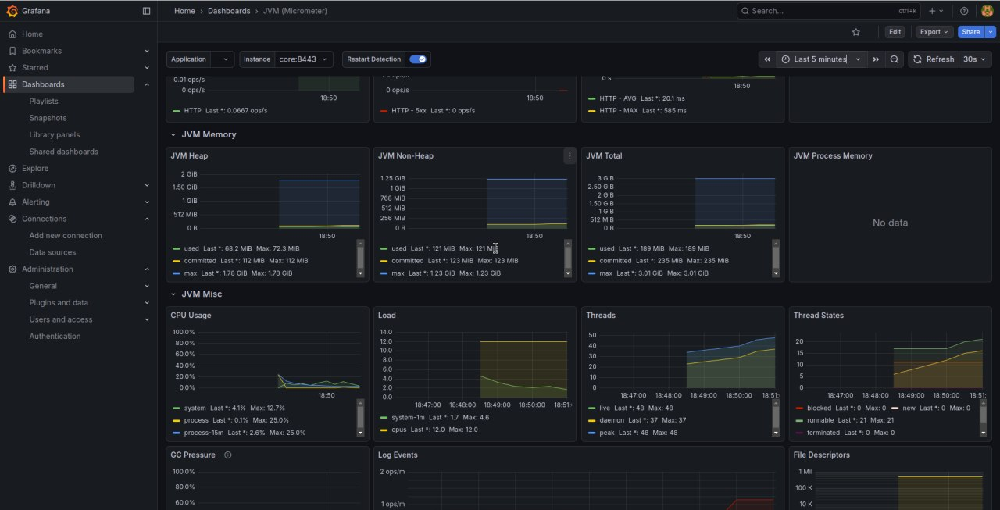
____
## CI/CD

Jenkins orchestrates a parallelized CI/CD pipeline to automate builds, tests, and deployments.
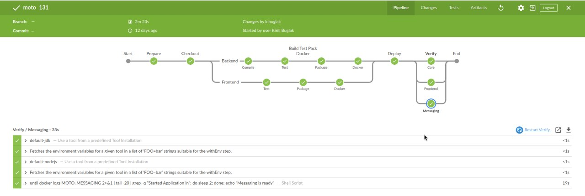

Test results are aggregated and stored in a predefined directory for traceability and reporting.
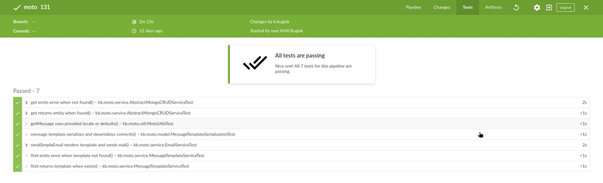
____
## Gradle
This is a multi-module Gradle project, with a shared "commons" module used by both "core" and "messaging" services.  
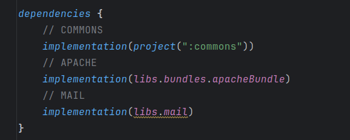  

All dependencies are centrally managed in libs.versions.toml, enabling consistent versioning and easy maintenance.  
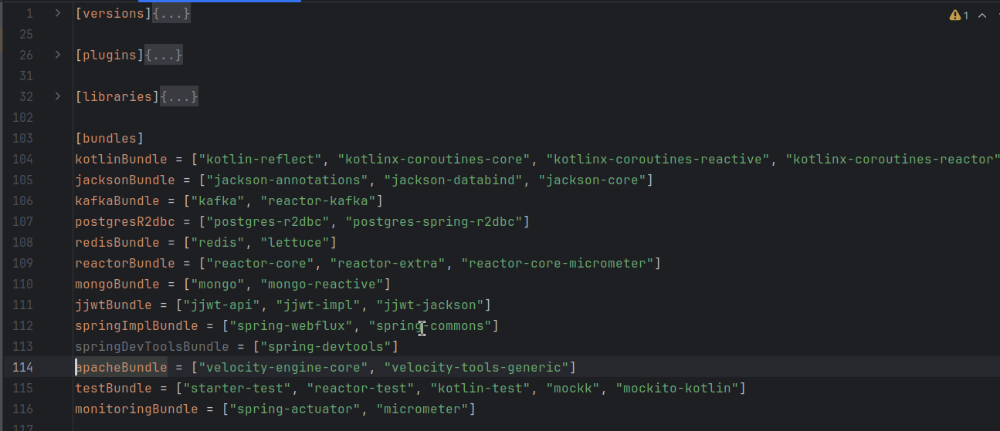
____
## How to build
You would need to:
<li>Create keystore.p12;</li>

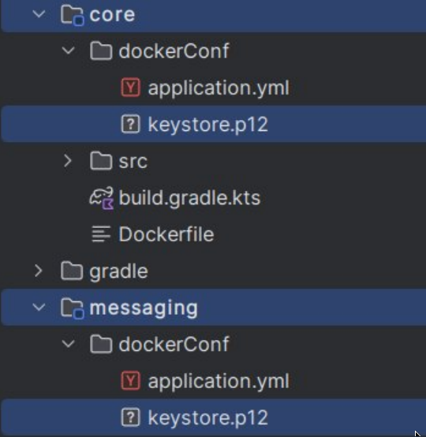  
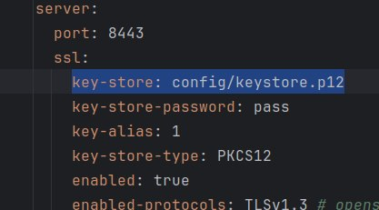
<li>Configure Gmail SMTP credentials</li>

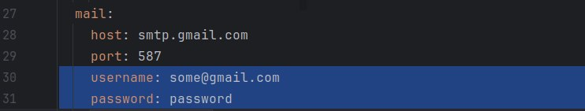
______